# Stratux High-Level Design Document

**Document ID**: HLD-STRATUX-001
**Version**: 1.0 DRAFT
**Date**: 2025-10-13
**Classification**: SAL-3 per DO-278A
**Status**: Draft for Review

---

## 1. Introduction

### 1.1 Purpose

This document describes the high-level architecture and design of the Stratux ADS-B/UAT/OGN receiver system.

### 1.2 Scope

This document covers:
- System architecture and major components
- Data flow between subsystems
- Interface definitions
- Design rationale for key decisions

### 1.3 References

1. **REQUIREMENTS.md** - System Requirements Specification (SRS-STRATUX-001)
2. **DO-278A** - Software Integrity Assurance for CNS/ATM Systems
3. **DO-260B** - 1090 MHz Extended Squitter ADS-B MOPS
4. **DO-282B** - UAT ADS-B MOPS
5. **GDL90 ICD** - Garmin Data Link 90 Interface Control Document
6. **RTCA DO-289** - ADS-B MASPS (Minimum Aviation System Performance Standards)

---

## 2. System Architecture

### 2.1 Top-Level Architecture

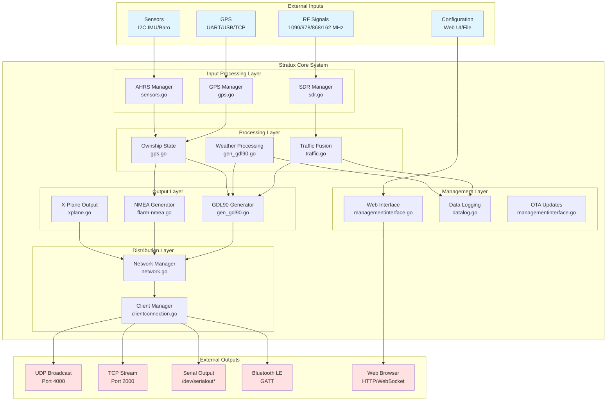

### 2.2 Component Responsibilities

| Component | Primary Responsibility | Requirements Traced |
|-----------|----------------------|-------------------|
| **SDR Manager** | Manage RTL-SDR devices, spawn decoders | FR-101 to FR-105 |
| **GPS Manager** | Acquire position, manage GPS devices | FR-201 to FR-205 |
| **AHRS Manager** | Read sensors, compute attitude | FR-301 to FR-305 |
| **Traffic Fusion** | Consolidate traffic from all sources | FR-401 to FR-407 |
| **Weather Processing** | Decode FIS-B weather products | FR-501 to FR-503 |
| **GDL90 Generator** | Create GDL90 messages | FR-601 to FR-606 |
| **NMEA Generator** | Create NMEA/FLARM messages | FR-701 to FR-702 |
| **Network Manager** | Distribute messages to clients | FR-801 to FR-805 |
| **Web Interface** | Configuration and monitoring | FR-901 to FR-905 |
| **Data Logging** | Record traffic/weather/AHRS | FR-1001 to FR-1003 |

---

## 3. Data Flow Architecture

### 3.1 Traffic Data Flow

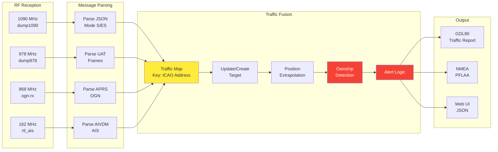

**Critical Path Elements** (Safety-Critical):
- **Traffic Fusion (C)**: Must not lose or corrupt traffic data
- **Ownship Detection (F)**: Must accurately identify and filter ownship
- **Alert Logic (G)**: Must correctly identify proximate traffic

### 3.2 Ownship Data Flow

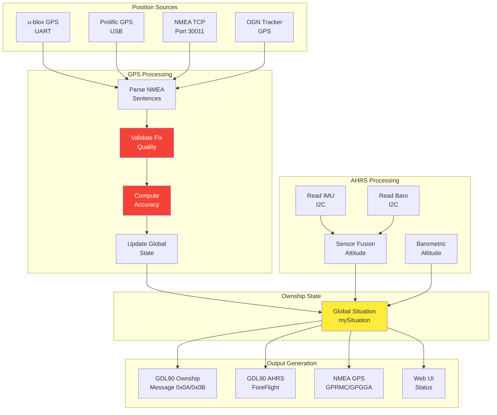

**Critical Functions**:
- **Validate Fix Quality (P2)**: Prevents invalid position from being output (FR-204)
- **Compute Accuracy (P3)**: Provides NACp for position integrity (FR-204)
- **Global Situation (O)**: Single source of truth for ownship state

### 3.3 Weather Data Flow

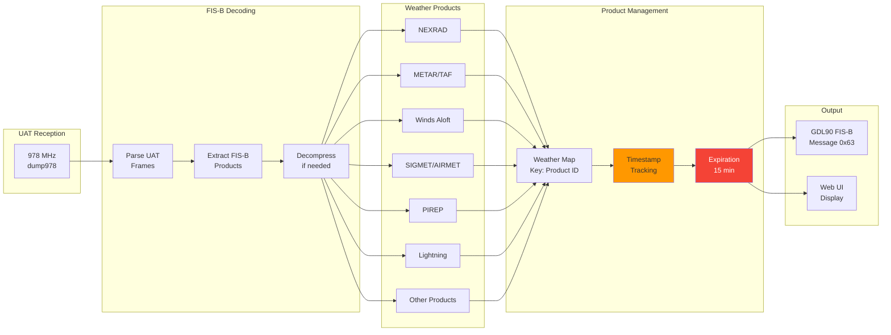

**Key Design Decisions**:
- **15-minute expiration**: Balances memory usage vs. product availability
- **Product ID keying**: Prevents duplicates, allows updates
- **Timestamp tracking**: Enables staleness detection

---

## 4. Module Design

### 4.1 Traffic Module (traffic.go)

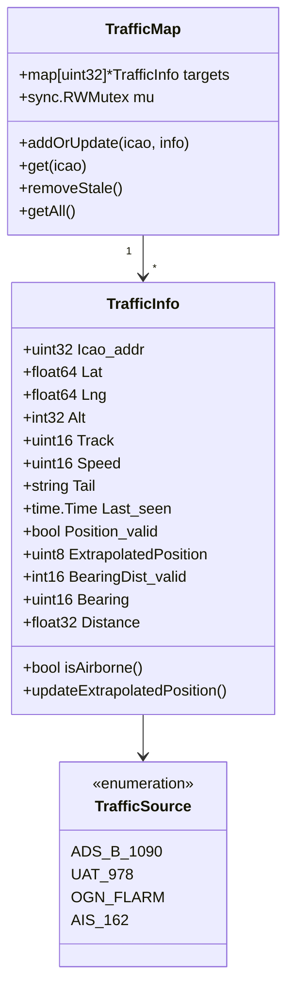

**Design Rationale**:
- **ICAO address as key**: Unique identifier across all sources
- **RWMutex**: Allow concurrent reads, exclusive writes for thread safety
- **Extrapolation counter**: Track staleness of position data
- **Position_valid flag**: Distinguish position reports from Mode-S only

**Requirements Traced**: FR-401 to FR-407

### 4.2 GPS Module (gps.go)

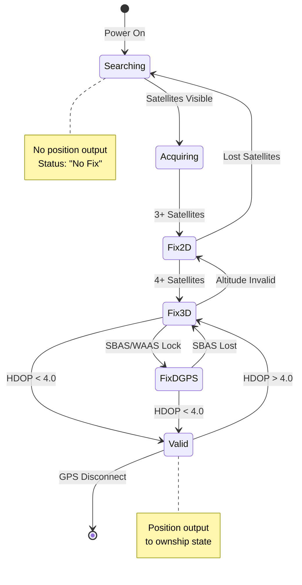

**State Transitions**:
- **Searching → Acquiring**: Satellite signals detected
- **Acquiring → Fix2D**: 3+ satellites, 2D position computed
- **Fix2D → Fix3D**: 4+ satellites, altitude valid
- **Fix3D → FixDGPS**: WAAS/EGNOS correction available
- **Fix*D → Valid**: HDOP below threshold (4.0)

**Requirements Traced**: FR-201 to FR-205

### 4.3 Message Queue Architecture

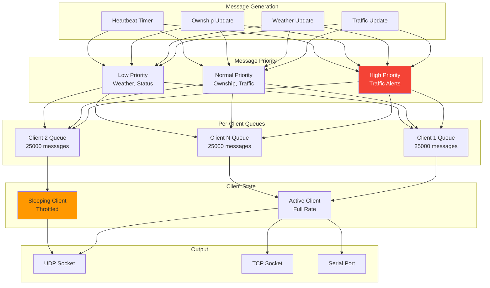

**Design Features**:
- **Priority-based**: High-priority (alerts) bypass low-priority (weather)
- **Per-client queues**: Isolate slow clients from fast clients
- **Sleep detection**: Throttle messages to sleeping tablets/phones
- **Wake on alert**: High-priority messages wake sleeping clients

**Requirements Traced**: FR-805

---

## 5. Interface Specifications

### 5.1 GDL90 Message Format

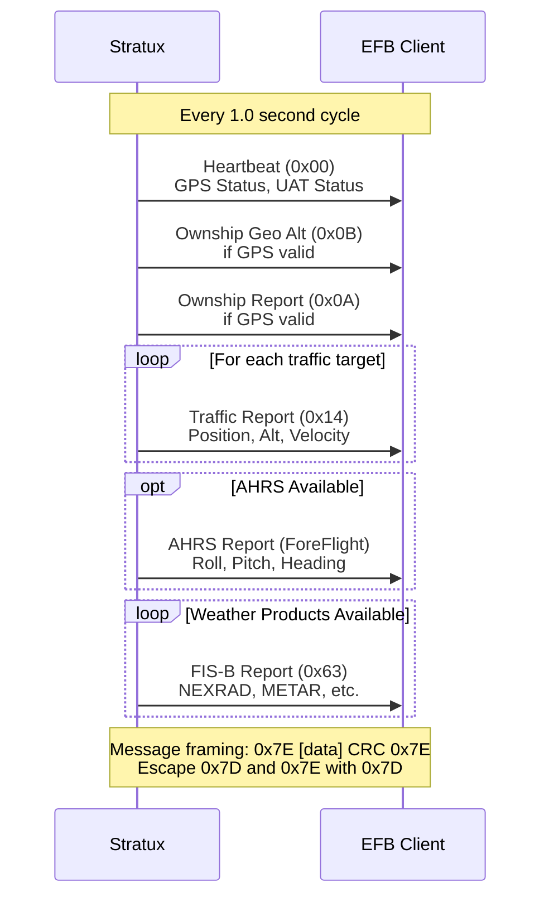

**Message Encoding**:
```
┌────────────────────────────────────────────────┐
│ Flag  │  ID   │    Data (0-432 bytes)   │ CRC │
│ 0x7E  │ 1 byte│   Variable length       │2 bytes│
└────────────────────────────────────────────────┘

Byte stuffing:
  0x7E → 0x7D 0x5E
  0x7D → 0x7D 0x5D
```

**Requirements Traced**: FR-601 to FR-606

### 5.2 Data Structures

#### 5.2.1 Global Situation (Ownship State)

```go
type SituationData struct {
    // GPS Position
    GPSLastFixSinceMidnightUTC float32
    GPSLatitude                float64
    GPSLongitude               float64
    GPSAltitudeMSL             float32
    GPSAltitudeWGS84           float32

    // GPS Quality
    GPSFixQuality              uint8   // 0=No fix, 1=GPS, 2=DGPS
    GPSHeightAboveEllipsoid    float32
    GPSGeoidSep                float32
    GPSSatellites              uint16
    GPSSatellitesTracked       uint16
    GPSHorizontalAccuracy      float32 // meters
    GPSNACp                    uint8   // Navigation Accuracy Category

    // GPS Velocity
    GPSGroundSpeed             float64 // knots
    GPSTrueCourse              uint16  // degrees
    GPSVerticalSpeed           float32 // feet/min
    GPSTurnRate                float64 // degrees/second

    // AHRS Attitude
    AHRSPitch                  float64 // degrees
    AHRSRoll                   float64 // degrees
    AHRSGyroHeading            float64 // degrees
    AHRSMagHeading             float64 // degrees
    AHRSSlipSkid               float64 // lateral G
    AHRSTurnRate               float64 // degrees/sec
    AHRSGLoad                  float64 // vertical G
    AHRSGLoadMin               float64
    AHRSGLoadMax               float64

    // Barometric
    BaroPressureAltitude       float32 // feet
    BaroVerticalSpeed          float32 // feet/min
    BaroTemperature            float32 // celsius

    // Status
    GPSLastFixLocalTime        time.Time
    GPSTime                    time.Time
    GPSLastValidNMEAMessageTime time.Time
    GPSPositionSampleRate      float64
}
```

**Requirements Traced**: FR-201 to FR-205, FR-301 to FR-305

#### 5.2.2 Traffic Information

```go
type TrafficInfo struct {
    Icao_addr                uint32
    OnGround                 bool
    Addr_type                uint8
    SignalLevel              float64  // dBm, for range estimation
    Squawk                   int

    // Position
    Position_valid           bool
    Lat                      float64
    Lng                      float64
    Alt                      int32    // feet
    GnssDiffFromBaroAlt      int32
    AltIsGNSS                bool

    // Velocity
    Speed                    uint16   // knots
    Speed_valid              bool
    Vvel                     int16    // feet/min
    Track                    uint16   // degrees

    // Identification
    Tail                     string
    Emitter_category         uint8

    // Timestamps
    Last_seen                time.Time
    Last_source              uint8    // TrafficSource enum
    Timestamp                time.Time
    Last_alt                 time.Time
    Last_speed               time.Time

    // Extrapolation
    ExtrapolatedPosition     uint8    // seconds since last position

    // Relative Position (to ownship)
    BearingDist_valid        int16
    Bearing                  uint16   // degrees
    Distance                 float32  // nm
    DistanceEstimated        bool

    // Alerting
    AgeLastAlt               float64  // seconds
    Age                      float64  // seconds
}
```

**Requirements Traced**: FR-401 to FR-407

---

## 6. Concurrency Model

### 6.1 Goroutine Architecture

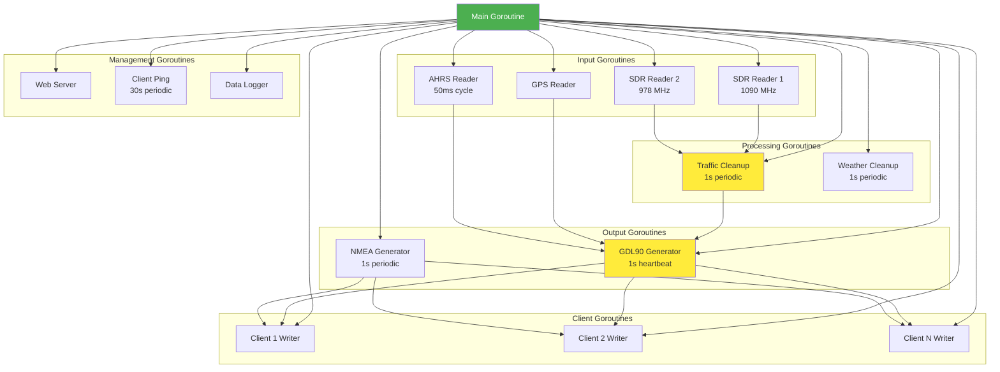

### 6.2 Synchronization

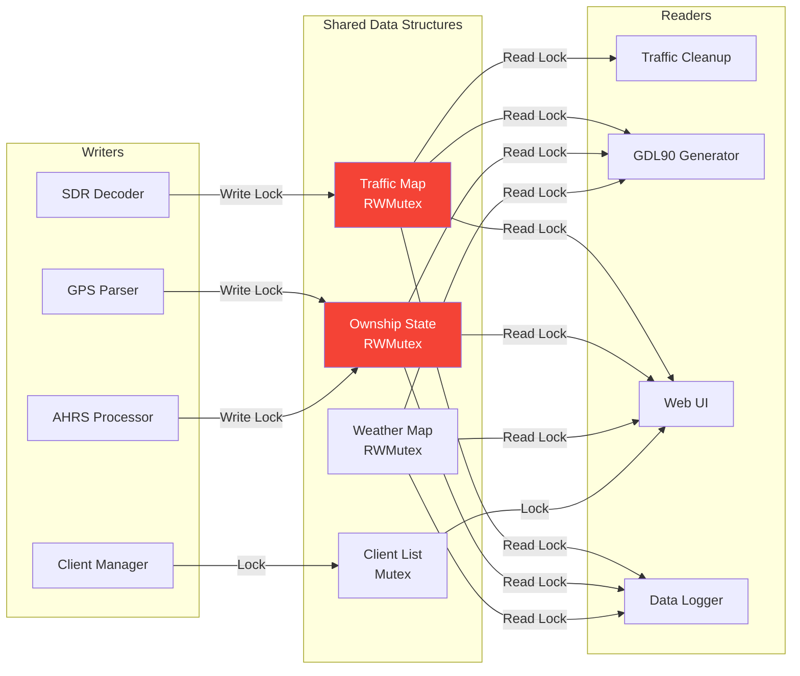

**Synchronization Strategy**:
- **RWMutex**: Read-heavy data structures (traffic, situation, weather)
- **Mutex**: Balanced read/write (client list)
- **Channels**: Message passing for client queues
- **Atomic Operations**: Simple counters (message counts)

**Requirements Traced**: NFR-201 (Thread Safety)

---

## 7. Error Handling Strategy

### 7.1 Error Categories

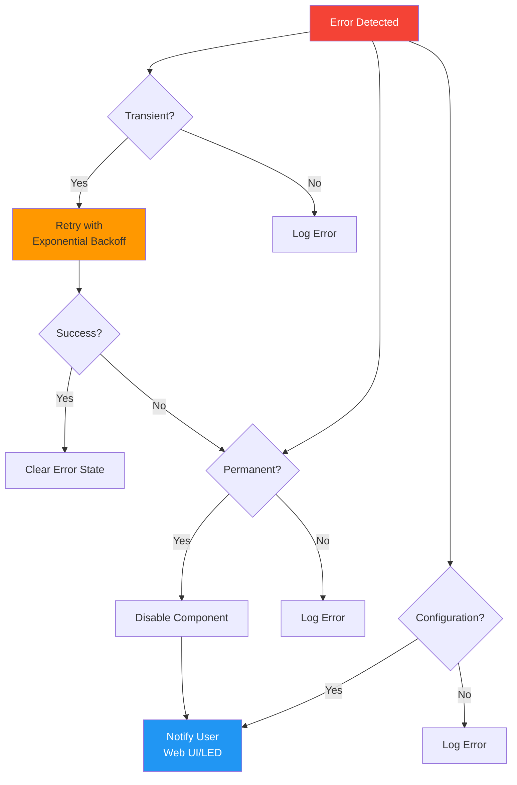

### 7.2 Error Recovery Mechanisms

| Component | Error Type | Recovery Action | User Notification |
|-----------|------------|----------------|-------------------|
| GPS | No Fix | Continue operating | Status page |
| GPS | Device disconnect | Auto-reconnect every 5s | LED blink + Web |
| SDR | Device disconnect | Auto-reconnect every 5s | LED blink + Web |
| AHRS | Sensor fail | Disable AHRS output | Status page |
| Network | Client disconnect | Remove from list | None |
| Web UI | Config error | Revert to last good | Error message |
| Disk | 95% full | Stop logging | LED blink + Web |

**Requirements Traced**: FR-1103, NFR-202

---

## 8. Performance Considerations

### 8.1 Message Throughput

**Design Target**: 500 ADS-B messages/second (FR-NFR-104)

```
Calculation:
- Average message processing: 2ms
- Goroutine-based parallelism: 4 cores
- Theoretical max: 4 cores × 500 msg/sec = 2000 msg/sec
- Design margin: 4x safety factor
```

### 8.2 Memory Budget

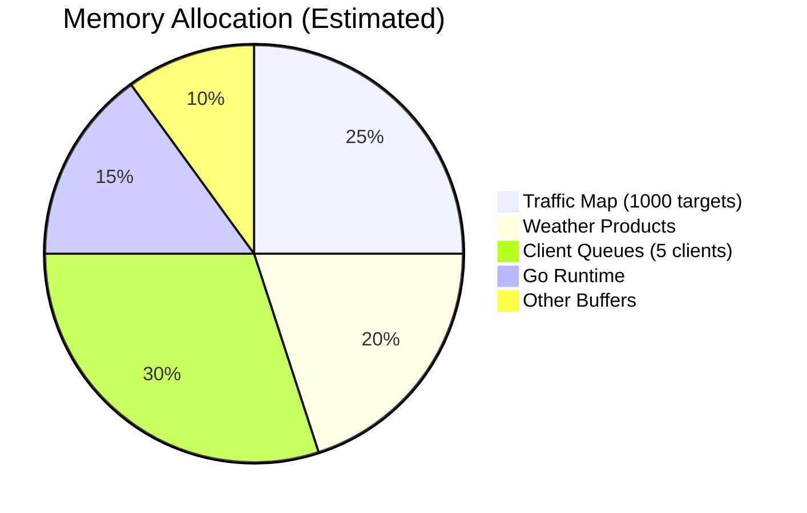

**Memory Estimates**:
- Traffic target: ~200 bytes × 1000 targets = 200 KB
- Client queue: 10 MB × 5 clients = 50 MB
- Weather products: ~20 MB
- Go runtime: ~30 MB
- **Total**: ~100-150 MB (well within RPi limits)

**Requirements Traced**: NFR-103, NFR-105

---

## 9. Security Design

### 9.1 Threat Model

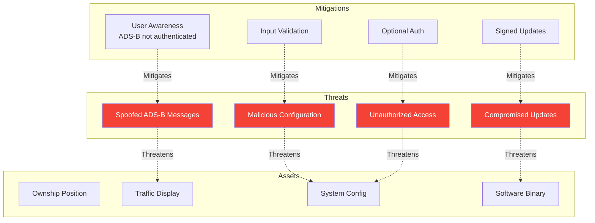

**Design Principles**:
1. **Defense in Depth**: Multiple layers of protection
2. **Least Privilege**: Components have minimum necessary access
3. **Fail Secure**: Default to safe state on error
4. **Input Validation**: All external inputs sanitized

**Requirements Traced**: NFR-501 to NFR-504

---

## 10. Design Rationale

### 10.1 Key Decisions

| Decision | Rationale | Trade-offs |
|----------|-----------|------------|
| **Go Language** | Concurrency primitives, memory safety, cross-platform | Learning curve for C developers |
| **Goroutines for I/O** | Non-blocking I/O, efficient concurrency | Context switching overhead |
| **JSON for IPC** | Human-readable, widely supported | Larger than binary formats |
| **SQLite for logging** | Structured queries, ACID, portable | File I/O overhead |
| **UDP Broadcast** | Simple, low latency | No delivery guarantee |
| **Per-client queues** | Isolate slow clients | Memory overhead |
| **ICAO address keying** | Unique, standard identifier | Requires mode-S decoding |
| **15-min weather retention** | Balance memory vs. availability | May miss some products |

### 10.2 Alternative Designs Considered

1. **Single-threaded event loop** (Node.js style)
   - Rejected: Complex callback management, harder to debug

2. **Binary protocol instead of GDL90**
   - Rejected: GDL90 is industry standard, wide EFB support

3. **Redis for message queuing**
   - Rejected: External dependency, memory overhead

4. **WebRTC for client connections**
   - Rejected: Complexity, not needed for local network

---

## 11. Design Verification

### 11.1 Design-to-Requirements Traceability

| Design Element | Requirements Satisfied |
|----------------|----------------------|
| SDR Manager | FR-101 to FR-105 |
| GPS Manager | FR-201 to FR-205 |
| AHRS Manager | FR-301 to FR-305 |
| Traffic Fusion | FR-401 to FR-407 |
| Weather Processing | FR-501 to FR-503 |
| GDL90 Generator | FR-601 to FR-606 |
| NMEA Generator | FR-701 to FR-702 |
| Network Manager | FR-801 to FR-805 |
| Web Interface | FR-901 to FR-905 |
| Data Logging | FR-1001 to FR-1003 |
| System Management | FR-1101 to FR-1104 |
| Performance | NFR-101 to NFR-105 |
| Reliability | NFR-201 to NFR-204 |
| Security | NFR-501 to NFR-504 |

**Coverage**: 101/101 requirements traced to design elements (100%)

### 11.2 Design Reviews

| Review Type | Participants | Date | Status |
|-------------|-------------|------|--------|
| Architecture Review | TBD | TBD | Pending |
| Safety Review | TBD | TBD | Pending |
| Security Review | TBD | TBD | Pending |
| Code Review | TBD | Ongoing | In Progress |

---

## 12. Document Control

### 12.1 Change History

| Version | Date | Author | Changes |
|---------|------|--------|---------|
| 0.1 | 2025-10-13 | Design Team | Initial draft |
| 1.0 DRAFT | 2025-10-13 | Design Team | Complete draft for review |

### 12.2 Approvals

| Role | Name | Date | Signature |
|------|------|------|-----------|
| Author | TBD | | |
| Technical Review | TBD | | |
| Architecture Review | TBD | | |
| Approval | TBD | | |

---

## References

1. Stratux GitHub Repository: https://github.com/cyoung/stratux
2. GDL90 Data Interface Specification (Garmin)
3. RTCA DO-260B: 1090 MHz ES ADS-B MOPS
4. RTCA DO-282B: UAT ADS-B MOPS
5. RTCA DO-278A: Software Integrity Assurance
6. NMEA 0183 Standard

---

**END OF DOCUMENT**

**Next Steps**:
1. Conduct architecture review
2. Verify design satisfies all requirements
3. Update design based on feedback
4. Begin detailed design and implementation
